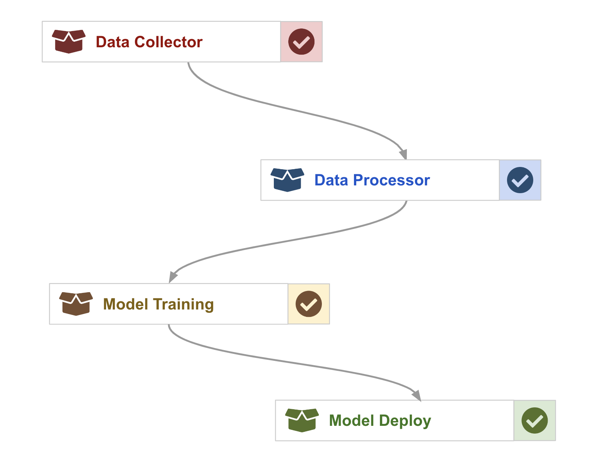
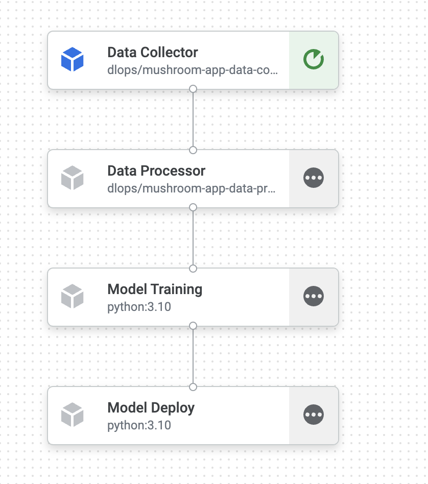
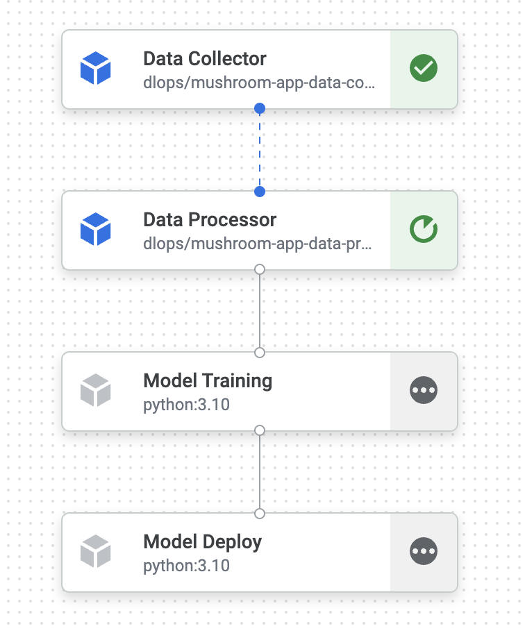
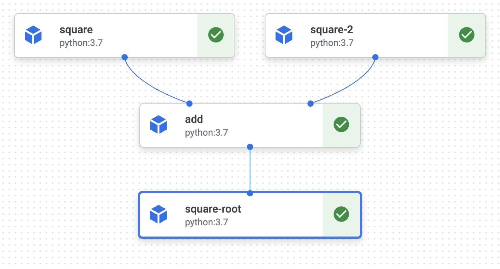

# Mushroom App: ML Workflow Management

In this tutorial we will put all the components we built for our Mushroom App together. We will then apply workflow management methods to test, execute, monitor, and automate these components:
* Data Collector: Scraps image from the internet and stores them into a `raw` folder.
* Data Processor: Checks images for duplicates, validate image formats, converts images to TF Records
* Model Training: Submits training jobs to Vertex AI to train models
* Model Deploy: Updates trained models signature with preprocessing logic added to it. Upload model to Vertex AI Model Registry and Deploy model to Model Endpoints.


## Prerequisites
* Have Docker installed
* Cloned this repository to your local machine with a terminal up and running
* Check that your Docker is running with the following command

`docker run hello-world`

### Install Docker 
Install `Docker Desktop`

#### Ensure Docker Memory
- To make sure we can run multiple container go to Docker>Preferences>Resources and in "Memory" make sure you have selected > 4GB

### Install VSCode  
Follow the [instructions](https://code.visualstudio.com/download) for your operating system.  
If you already have a preferred text editor, skip this step.  

## Setup Environments
In this tutorial we will setup a container to manage packaging python code for training and creating jobs on Vertex AI (AI Platform) to run training tasks.

**In order to complete this tutorial you will need your GCP account setup and a WandB account setup.**

### Clone the github repository
- Clone or download from [here](https://github.com/dlops-io/ml-workflow)

### API's to enable in GCP for Project
Search for each of these in the GCP search bar and click enable to enable these API's
* Vertex AI API

### Setup GCP Credentials
Next step is to enable our container to have access to Storage buckets & Vertex AI(AI Platform) in  GCP. 

#### Create a local **secrets** folder

It is important to note that we do not want any secure information in Git. So we will manage these files outside of the git folder. At the same level as the `ml-workflow` folder create a folder called **secrets**

Your folder structure should look like this:
```
   |-ml-workflow
      |-images
        |-src
        |---data-collector
        |---data-processor
        |---model-deploy
        |---model-training
        |---workflow
   |-secrets
```

#### Setup GCP Service Account
- Here are the step to create a service account:
- To setup a service account you will need to go to [GCP Console](https://console.cloud.google.com/home/dashboard), search for  "Service accounts" from the top search box. or go to: "IAM & Admins" > "Service accounts" from the top-left menu and create a new service account called "ml-workflow". For "Service account permissions" select "Storage Admin", "AI Platform Admin", "Vertex AI Administrator", "Service Account User".
- This will create a service account
- On the right "Actions" column click the vertical ... and select "Manage keys". A prompt for Create private key for "ml-workflow" will appear select "JSON" and click create. This will download a Private key json file to your computer. Copy this json file into the **secrets** folder. Rename the json file to `ml-workflow.json`

### Create GCS Bucket

We need a bucket to store files that we will be used by Vertext AI Pipelines during the ML workflow.

- Go to `https://console.cloud.google.com/storage/browser`
- Create a bucket `mushroom-app-ml-workflow-demo` [REPLACE WITH YOUR BUCKET NAME]

## Data Collector Container

The data collector container does the following:
* Downloads images from Bing based on the search terms provided
* Organizes the label folders as the search terms
* Zip the images and uploads to GCS Bucket
* If you run `cli.py` with the appropriate arguments your output folder should look like:
```
|-raw
   |---amanita mushrooms
   |---crimini mushrooms
   |---oyster mushrooms

```

### Create .env file
Create a .env file in the root of the git working tree; e.g. (*note: customize for your project*):
```
CONTAINER_REGISTRY=docker.io/my-dockerhub-username
GCP_PROJECT=my-gcp-project
GCP_REGION=us-central1
GCS_BUCKET_NAME=mushroom-app-ml-workflow-demo
GCS_PACKAGE_URI=gs://mushroom-app-ml-workflow-demo
GCS_SERVICE_ACCOUNT=ml-workflow@ac215-project.iam.gserviceaccount.com
```
### Run Data Collector Container & Test CLI
#### Test Data Collector

* Run `docker compose run --rm data-collector --search --nums 10 --query "oyster mushrooms" "crimini mushrooms" "amanita mushrooms"`
* Go and check your GCS bucket to see if `raw.zip` was uploaded. 

### OPTIONAL: Run Data Processor Container & Test CLI
#### Test Data Processor

* Run `docker compose run --rm data-processor --clean`
* Go and check your GCS bucket to see if `clean.zip` was uploaded. 
* Run `docker compose run --rm data-processor --prepare`
* Go and check your GCS bucket to see if `tfrecords.zip` was uploaded. 

### OPTIONAL: Run Model Training Container & Test CLI
#### Test Model Training

##### Local Training
* Run `docker compose run --rm model-training-local --epochs=1 --batch_size=4`
##### Remote Training
* Run `docker compose run --rm --entrypoint=/app/package-trainer.sh model-training`, this will package the trainer code and upload into a bucket
* Run `docker compose run --rm model-training --train`, this will invoke a Vertex AI training job


## OPTIONAL: Build & Push Data Collector Image
This step has already been done for this tutorial. For this tutorial in order to make the docker images public we pushed them to docker hub. 

### Pushing Docker Image to Docker Hub
* Sign up in Docker Hub and create an [Access Token](https://hub.docker.com/settings/security)
* Login to the Hub: `docker login -u <USER NAME> -p <ACCESS TOKEN>`
* Build and Tag the Docker Image: `docker compose build data-collector`
* If you are on M1/2 Macs: Build and Tag the Docker Image: `DOCKER_DEFAULT_PLATFORM=linux/amd64 docker compose build data-collector`
* Push to Docker Hub: `docker compose push data-collector`


## Automate Running Data Collector Container

In this section we will use Vertex AI Pipelines to automate running the task in our data collector container

### Run Data Collector in Vertex AI
In this step we will run the data collector container as a serverless task in Vertex AI Pipelines.

* Run `docker compose run --rm workflow --data_collector`, this will package the data collector docker image as a Vertex AI Pipeline job and create a definition file called `data_collector.yaml`. This step also creates an `PipelineJob` to run on Vertex AI
* Inspect `data_collector.yaml`
* Go to [Vertex AI Pipeline](https://console.cloud.google.com/vertex-ai/pipelines) to inspect the status of the job

## Mushroom App: Vertex AI Pipelines

In this section we will use Vertex AI Pipelines to automate running oa all the tasks the mushroom app

### Run Workflow Pipeline in Vertex AI
In this step we will run the workflow as serverless tasks in Vertex AI Pipelines.

#### Entire Pipeline
* Run `docker compose run --rm workflow --pipeline`, this will orchestrate all the tasks for the workflow and create a definition file called `pipeline.yaml`.
* Inspect `pipeline.yaml`
* Go to [Vertex AI Pipeline](https://console.cloud.google.com/vertex-ai/pipelines) to inspect the status of the job

You should be able to see the status of the pipeline in Vertex AI similar to this:


<br>



#### Test Specific Components

* For Data Collector: Run `docker compose run --rm workflow --data_collector`
* For Data Processor: Run `docker compose run --rm workflow --data_processor`
* For Model Training: Run `docker compose run --rm workflow --model_training`
* For Model Deploy: Run `docker compose run --rm workflow --model_deploy`


## Vertex AI Pipelines: Samples

In this section we will simple pipelines and run it on Vertex AI

#### Run Simple Pipelines

* Sample Pipeline 1: Run `docker compose run --rm workflow --simple1`

<br>